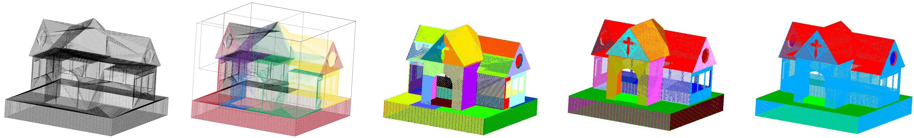

# Urban-SemSeg

A pipeline to segment high-resolution point clouds representing urban environments into geometric primitives; we focus on planes, cylinders and spheres, which are the main features of buildings (walls, roofs, arches, ...) and
ground surfaces (streets, pavements, platforms), and identify the unique parameters of each instance. 

It focuses on the semantic segmentation of buildings, but the approach is currently being generalised to manage extended urban areas. Given a dense point cloud representing a specific building, we firstly apply a binary space partitioning method to obtain small enough sub-clouds that can be processed. Then, a combination of the well-known RANSAC algorithm and a recognition method based on the Hough transform (HT) is applied to each sub-cloud to obtain a semantic segmentation into salient elements, like façades, walls and roofs. The parameters of primitive instances are saved as metadata to document the structural element of buildings for further thematic analyses, e.g., energy efficiency.
